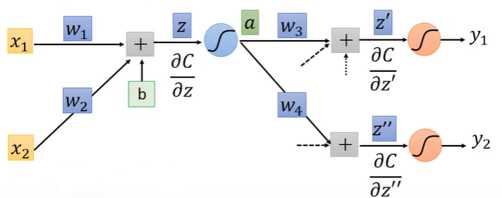

# Backpropagation(补充)

目的：To compute the gradients efficiently

### 1 Gradient Desent过程

1.1 Network parameters $$ \theta = \{\omega_{1}, \omega_{2} ,\cdots, b_{1}, b_{2},\cdots\}$$

1.2 $$  \nabla L(\theta)=\begin{bmatrix} \partial L(\theta)/\partial \omega_{1} \\ \partial L(\theta)/\partial \omega_{2} \\ \vdots \\ \partial L(\theta)/\partial b_{1} \\ \partial L(\theta)/\partial b_{2} \\ \vdots \end{bmatrix}$$ &nbsp; Compute $$ \nabla L(\theta^0)$$ &nbsp;  &nbsp; $$\theta^1 = \theta^0 - \eta\nabla L(\theta^1)$$

1.3 $$ \theta^0 \longrightarrow \theta^1 \longrightarrow \theta^2 \cdots$$

### 2 Backpropagation原理

#### 2.1 Chain Rule 

2.1.1 单元连续求导: y=g(x)&nbsp; &nbsp;z=h(y)

&emsp; &emsp; &emsp;$$ \Delta x\rightarrow \Delta y \rightarrow \Delta z $$ &emsp; &emsp; $$ \frac{dz}{dx}= \frac{dz}{dy}\frac{dy}{dx}$$

2.1.2 多元连续求导： x=g(s) &emsp;y=h(s)&emsp;z=k(x,y) 
&emsp; &emsp; $$\Delta x$$ 
&emsp; $$\nearrow$$ &emsp; $$\searrow$$ 
$$\Delta s$$ &emsp; &emsp; &emsp;$$\Delta z$$ &emsp; &emsp;$$ \frac{dz}{dx}= \frac{\partial z}{\partial x}\frac{dx}{ds}+\frac{\partial z}{\partial y}\frac{dy}{dx}$$ 
&emsp; $$\searrow$$ &emsp; $$\nearrow$$ 
&emsp; &emsp; $$\Delta y$$  

#### 2.2 Backpropagation在神经网络图的应用

$$
L(\theta)= \sum\limits_{n=1}\limits^NC^n(\theta)  \Rightarrow   \frac{\partial L(\theta)}{\partial \omega}=\frac{\sum\limits_{n=1}\limits^NC^n(\theta)}{\partial \omega}
$$

根据链式法则可以计算 $$ \frac{\partial C(\theta)}{\partial \omega}= \frac{\partial C}{\partial z} \frac{\partial z}{\partial w}$$

(z为带入激活函数后的结构)

##### 2.2.1 Forward pass

对于$$\frac{\partial z}{\partial w}$$来讲,容易计算即为$$ x_{1}, x_{2} \cdots x_{n}$$

##### 2.2.2 Backward pass

$$\frac{\partial C}{\partial z}$$则需要从最后一步反过来推导

$$\frac{\partial C}{\partial z}=\frac{\partial C}{\partial \sigma(z)}\frac{\partial \sigma(z)}{\partial z}$$

$$\frac{\partial \sigma(z)}{\partial z}$$也可以一步求导（函数的导数）$$ \partial \sigma ^{'}(z)$$

$$\frac{\partial C}{\partial \sigma(z)}=\frac{\partial C}{\partial z_{2}^{1}}\frac{\partial z_{2}^{1}}{\partial \sigma(z)}+\frac{\partial C}{\partial z_{2}^{2}}\frac{\partial z_{2}^{2}}{\partial \sigma(z)}=\omega_{3}\frac{\partial C}{\partial z_{2}^{1}}+\omega_{4}\frac{\partial C}{\partial z_{2}^{2}}$$

($$ z_{2}^{1}$$为$$z^{'},z_{2}^{2}$$为$$z^{''}$$)

总的推导式为

$$\frac{\partial C}{z}= \sigma^{'}(z)[\omega_{3}\frac{\partial C}{\partial z_{2}^{1}}+\omega_{4}\frac{\partial C}{\partial z_{2}^{2}}]$$

##### 2.2.3 怎样计算最后的式子

2.2.3.1 Case：Output Layer

$$\frac{\partial C}{\partial z^{'}}=\frac{\partial C}{\partial y_{1}}\frac{\partial y_{1}}{\partial z^{'}}$$

$$\frac{\partial y_{1}}{\partial z^{'}}$$为最后一层激活函数的导数，$$\frac{\partial C}{\partial y_{1}}$$要看选择怎样的损失函数

2.2.3.2 Case：NOT Output Layer
 
知道后边一层的导数即可以计算出前边一层的导数